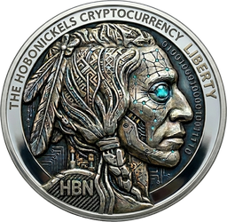

<div align="center">



# HoboNickels (HBN)

**A Scrypt proof-of-work / proof-of-stake hybrid cryptocurrency — a 2014-era
Bitcoin / Peercoin / Novacoin fork, modernized to build and run on a current toolchain.**

[](https://github.com/hclivess/HoboNickels/actions/workflows/ci.yml)
[](https://github.com/hclivess/HoboNickels/releases/latest)
[](COPYING)


[Download](#download) · [Build from source](#build-from-source) · [Specifications](#specifications) · [Documentation](#documentation)

</div>

---

HoboNickels is a self-mintable PoS coin: hold coins in an unlocked wallet and it
**stakes** them to earn rewards and secure the network. This repository is a
modernization of the original 2014 client — the consensus rules (signatures,
addresses, hashing, the kernel) are **byte-for-byte unchanged and fully
network-compatible**, while everything around them was brought up to date:

- 🛠️ **Modern toolchain** — Ubuntu 24.04 · GCC 13 · OpenSSL 3 · Boost 1.83 ·
  Berkeley DB · Qt 5, built with **CMake** (the old autotools/`.pro` system is retired).
- ⚡ **Faster sync, lower overhead** — libsecp256k1 signature verification (OpenSSL
  fallback, no fork), dynamic checkpointing, and tuned LevelDB caching.
- 🖥️ **Modern Qt5 wallet** — high-DPI aware, light/dark themes (`-uitheme`), a fully
  redrawn flat icon set and coin-render branding (no 2014 artwork left).
- 🪙 **Smarter staking** — autocombine actually consolidates ripe dust and split no
  longer fragments stakes; the per-block staking metadata cache cuts disk I/O. All
  wallet policy — no consensus change.
- 🔌 **Modern RPC** — lightweight read-only endpoints (`getblockchaininfo`,
  `getnetworkinfo`, `getwalletinfo`, `getblockheader`, `getmempoolinfo`, `uptime`).
- ✅ **CI & Docker** — every change is built and tested on Linux + Windows + Docker.

> **Latest release: [v2.0.6-modern](https://github.com/hclivess/HoboNickels/releases/latest)** —
> working autocombine + saner split defaults, on top of a fully modernized UI.
> See [`doc/MODERNIZATION.md`](doc/MODERNIZATION.md) for the full list of changes.

## Download

Pre-built, self-contained binaries for **Linux** and **Windows** are on the
[**Releases page**](https://github.com/hclivess/HoboNickels/releases/latest):

| Component | Linux | Windows |
| --- | --- | --- |
| **Daemon** (headless) | `HoboNickelsd-*-linux-x86_64` | `HoboNickelsd-*-windows-x86_64.zip` |
| **Wallet GUI** (Qt5) | `HoboNickels-qt-*-linux-x86_64` | `HoboNickels-qt-*-windows-x86_64.zip` |

The Windows `.zip`s bundle every runtime DLL (and the Qt platform plugin) and are
verified in CI to launch with the build toolchain off the `PATH` — just unzip and
run the `.exe`.

## Build from source

**Linux (daemon):**

```sh
sudo apt-get install -y build-essential cmake pkg-config \
    libboost-all-dev libssl-dev libdb++-dev libminiupnpc-dev zlib1g-dev
cmake -S . -B build -DCMAKE_BUILD_TYPE=Release
cmake --build build -j"$(nproc)"
./build/HoboNickelsd --help
```

Add the **Qt5 GUI** with `-DWITH_QT_GUI=ON` (needs `qtbase5-dev qttools5-dev`). For
the GUI, Windows/MSYS2, Docker, unit tests, and all other options see
[`doc/build-unix-modern.md`](doc/build-unix-modern.md).

## Run

```sh
# create the data dir + config (the daemon prints a suggested rpcpassword on first run)
./build/HoboNickelsd          # start the node
./build/HoboNickelsd getinfo  # query it
```

Known-good peers and DNS seeds are built in. Tunable options (sync, staking,
networking, GUI theme) are documented in
[`doc/configuration.md`](doc/configuration.md).

## Specifications

| | |
| --- | --- |
| **Algorithm** | Scrypt |
| **Type** | Hybrid Proof-of-Work + Proof-of-Stake |
| **PoW block reward** | 5 HBN |
| **Supply** | No fixed cap — proof-of-stake is inflationary |
| **Confirmations** | 25 |
| **Difficulty retarget** | Linear |
| **Stake reward** | 20% min → 100% max annual, capped at 250 HBN |
| **Stake weight** | 1 day min, 30 days max |
| **Default P2P port** | 7372 |
| **Default RPC port** | 7373 |

*Based on NovaCoin / BitGems / Bottlecaps.*

## Wallet features

- **Proof-of-stake minting** with **Stake-For-Charity** — donate a configurable
  percentage of each stake to an address.
- **Multi-wallet** — dynamically load and unload wallets at runtime.
- **Automatic stake-output management** — autocombine consolidates ripe small
  outputs and split keeps them a sensible size, plus coin control; all tunable via
  `splitthreshold` / `combinethreshold`.
- **Built-in block browser** and **network graph**.
- At-a-glance **peer, stake, and block** information.
- Modern **Qt5 GUI**: high-DPI, light/dark/native themes (`-uitheme`).
- **RPC console** in the GUI exposing the full command set.
- **Self-compacting wallet** — `wallet.dat` is rewritten automatically so it never
  bloats over time (`-walletcompact`, on by default; `compactwallet` RPC on demand).

## Tools

- **[`contrib/explorer/`](contrib/explorer/)** — a single-file, dependency-free
  (Python 3 stdlib only) **block explorer**. Point it at a local node and browse
  the chain in your browser: `python3 contrib/explorer/hbn_explorer.py`. Read-only.

## Documentation

Everything lives under [`doc/`](doc/):

| Document | What it covers |
| --- | --- |
| [MODERNIZATION.md](doc/MODERNIZATION.md) | What changed and why — start here |
| [build-unix-modern.md](doc/build-unix-modern.md) | Building with CMake (daemon, GUI, Windows, Docker, tests) |
| [configuration.md](doc/configuration.md) | Runtime options (sync, staking, networking, GUI, RPC) |
| [gui.md](doc/gui.md) | The Qt5 wallet — theming, high-DPI, RPC console |
| [staking-performance.md](doc/staking-performance.md) | How PoS minting works and the performance work |
| [performance.md](doc/performance.md) | Sync/validation/memory optimizations + the deferred roadmap |

Brand and UI graphics for designers are in [`media-kit/`](media-kit/).

## License

Released under the **MIT/X11** license — see [COPYING](COPYING). Built on the work
of the Bitcoin, Peercoin (PPCoin), and Novacoin developers.
